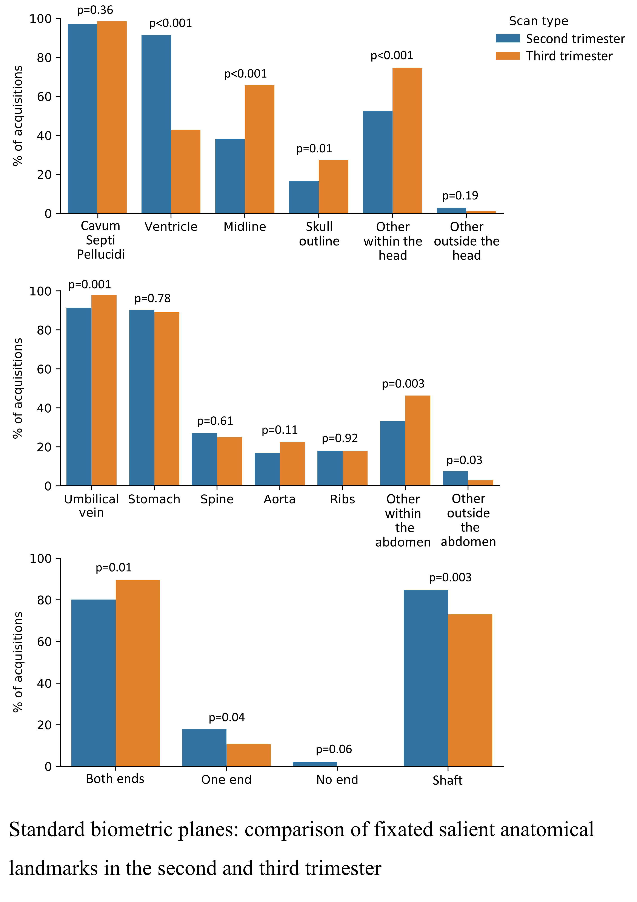

*L. Drukker and R. Droste contributed equally to this work.



---
# BibTex

```
@article{doi:10.1002/uog.22958,
  author = {Drukker, L. and Droste, R. and Noble, A. and Papageorghiou, A.T.},
  title = {VP40.20: Standard biometric planes: what are the salient anatomical landmarks?},
  journal = {Ultrasound in Obstetrics \& Gynecology},
  volume = {56},
  number = {S1},
  pages = {235-235},
  doi = {10.1002/uog.22958},
  url = {https://obgyn.onlinelibrary.wiley.com/doi/abs/10.1002/uog.22958},
  eprint = {https://obgyn.onlinelibrary.wiley.com/doi/pdf/10.1002/uog.22958},
  year = {2020}
}

```
